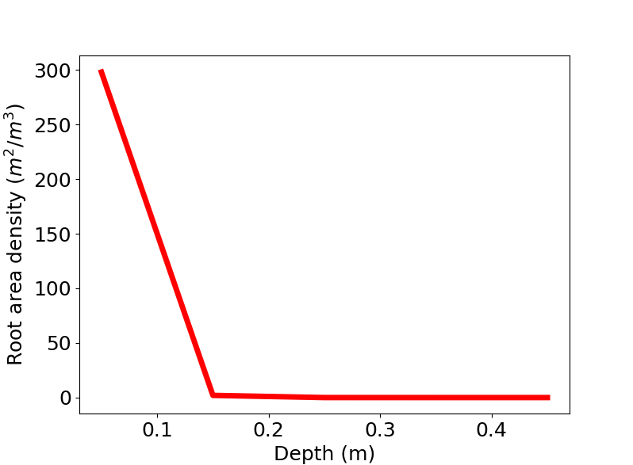
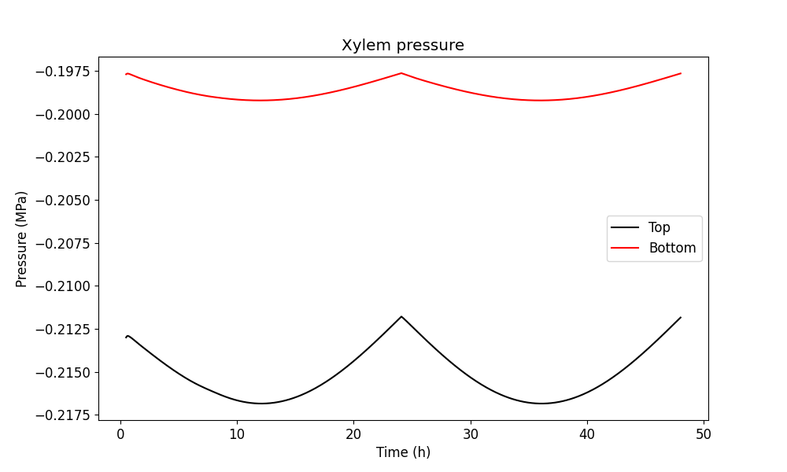

Instructions to run the model
=============================

There are two options to run the model. To quickest and easiest way is to run main.py which has a single profile loaded. The more challenging way is the import the src.model module, create instances of tree and model classes and run the model. 

Running from main.py
--------------------
The main.py can be run with command

```console
>>> python main.py
```

Below the main.py is discussed line by line. Simulations that require only parameter value changes can be run by editing the main.py.

Importing src.model
-------------------

### Imports

```python
from src.model import Model
from src.roots import Roots
from src.soil import Soil
from src.tree import Tree
from src.tools.plotting import plot_xylem_pressure_top_bottom
import matplotlib.pyplot as plt
from typing import List
import numpy as np
import math
from datetime import datetime
```

The Model, Tree, Roots and Soil classes are needed to create the instances of the modelled system, to run the model and save the
simulation output. Datetime is used to output the current time when running the model and for  setting the name of the output file. The plot_xylem_pressure_top_bottom function is used to plot the xylem pressure at the end of the simulation.

### Define soil properties
```python
z = np.linspace(0, 1, 11)
soil_layer_thickness = np.array(np.diff(z))
pressure = np.zeros((len(soil_layer_thickness), 1))-2e4  # Pa
hydraulic_conductivity = np.ones((len(soil_layer_thickness), 1))*1e-9  # m/s
soil = Soil(layer_thickness=soil_layer_thickness,
            hydraulic_conductivity=hydraulic_conductivity,
            pressure=pressure)
```

Set the soil to be 1 meter deep, the soil water potential to be -0.02 MPa everywhere in the soil and
the horizontal hydraulic conductivity to be 10<sup>-9</sup> ms<sup>-1</sup>. 

### Define root properties
Roots are a separate class. An instance of the Roots class is given as an argument to the tree class later. First we need to create the roots object

```python
root_elements = 5
area_density = np.zeros((root_elements, 1))

RAI = 30  # m^2 root / tree
area_density = np.ones((root_elements, 1))
effective_radius = 0.5e-3*np.ones((root_elements, 1))
rooting_depth = 0.5
area_per_tree = 1
roots = Roots(rooting_depth=rooting_depth, area_density=area_density,
                effective_radius=effective_radius, soil_conductance_scale=3e8,
                area_per_tree=area_per_tree, num_elements=root_elements)

dz = roots.layer_thickness(soil)
length = roots.layer_depth(soil)
a = 50
b = RAI/(np.sum(np.exp(-a*length)*dz))/area_per_tree

roots.area_density = b*np.exp(-a*length).reshape(roots.num_elements, 1)

```

The roots object has a rooting depth of 0.5 meters with 5 elements. The element thickness (0.1 meters), matches the thickness of the soil layers which is an intrinsic requirement of the model. The effective radius of the fine roots are set to be 0.5 mm in every layer. Each tree takes 1 m<sup>2</sup> of ground.

After the roots object is created, the area density is set to be exponential function of the depth or the roots (see the figure below). The area density has units m<sup>2</sup> roots / m<sup>3</sup> ground. The root area density is calculated such that the RAI = &sum; B<sub>i</sub> &Delta;z<sub>i</sub> A<sub>tree</sub> = 30 m$^2$ / tree where B is the root area density, &Delta; z<sub>i</sub> is the layer thickness and A<sub>tree</sub> is the ground area that the tree takes.



### Define tree properties
```python
height: float = 2.4

num_elements: int = 25  # 20 tree elements, 5 root elements
element_height = np.repeat(0.06, num_elements)
```
Set the total height of the modelled tree and number of elements in the whole tree (number of elements below and above ground). The element height is set to be the total height divided by the number of elements.


```python
transpiration_profile: List[float] = [0.0 for i in range(num_elements)]
photosynth_profile: List[float] = [0 for i in range(num_elements)]
sugar_loading_profile = photosynth_profile
```
Set the initial values for both transpiration in the xylem and photosynthesis in the tree. Note that 
currently sugar loading profile must equal photosynthesis profile.

```python
transpiration_max = 0.9e-3/600.0  # kg/s
photosynthesis_max = 2.5e-5/10.0  # mol/s

time = np.linspace(0, 24, 12*24+1)

transpiration = np.sin(time*math.pi/24.0)*transpiration_max
photosynthesis = np.sin(time*math.pi/24.0)*photosynthesis_max
```
Define the positive sine shaped curves for 24h period that peak at the maximum values (transpiration_max and photosynthesis_max). The time step in the time vector is 5 minutes.

```python
sugar_profile: np.ndarray = np.zeros((num_elements, 1))
sugar_profile[0:20, 0] = 700
sugar_profile[20:30, 0] = 500
sugar_profile[30:40, 0] = 400
```
Set the initial sugar concentration in the phloem (molm<sup>-3</sup>). Note that the tree properties can be set either as a list (as was done for e.g. transpiration profile) or as NumPy arrays. All properties are converted to NumPy arrays using the numpy.asarray function in the Tree class.

```python
sugar_unloading_profile: List[float] = [0.0 for i in range(num_elements)]

sugar_target_concentration: float = 700

sugar_unloading_slope = 3.5e-7
```
Set the initial sugar unloading rate and parameters for calculating the unloading rate further. The sugar_target_concentration is the concentration after which sugar unloading starts and sugar_unloading_slope is the slope parameter (units m/s) for the unloading. See [Nikinmaa et. al., (2014)](https://academic.oup.com/aob/article/114/4/653/2769025) for further details.

```python
axial_permeability_profile: np.ndarray = np.zeros((num_elements, 2))
axial_permeability_profile[:, 0] += 1.5e-13
axial_permeability_profile[:, 1] += 1.2e-13

for (row, permeability) in enumerate(axial_permeability_profile):
    axial_permeability_profile[row, 0] = np.min([permeability[0],
                                                    permeability[0]*1/math.sqrt(height/num_elements*(row+1))])
    axial_permeability_profile[row, 1] = np.min([permeability[1],
                                                    permeability[1]*1/math.sqrt(height/num_elements*(row+1))])

axial_permeability_profile = np.flip(axial_permeability_profile, axis=0)
```
Define an axial permeability (m<sup>2</sup>) for the modelled tree. In this case the axial permeabilities are inversely proportional to the square root of distance of an element from the ground.

```python
radial_hydr_conductivity: List[float] = [1e-13] * num_elements

elastic_modulus_profile: List[List[float]] = [[1000e6, 30e6]] * num_elements

radii: List[float] = [0.05, 0.1, 0.001]

```
Define the radial hydraulic conductivity (m Pa<sup>-1</sup> s<sup>-1</sup>) between xylem and phloem and elastic moduli (Pa) for every element. and the radius of heartwood, xylem and phloem (m).
```python
tree = Tree(height=height,
            element_height=element_height,
            num_elements=num_elements,
            initial_radius=radii,
            transpiration_profile=transpiration_profile,
            photosynthesis_profile=photosynth_profile,
            sugar_profile=sugar_profile,
            sugar_loading_profile=sugar_loading_profile,
            sugar_unloading_profile=sugar_unloading_profile,
            sugar_target_concentration=sugar_target_concentration,
            sugar_unloading_slope=sugar_unloading_slope,
            axial_permeability_profile=axial_permeability_profile,
            radial_hydraulic_conductivity_profile=radial_hydr_conductivity,
            elastic_modulus_profile=elastic_modulus_profile,
            roots=roots)
```
Create an instance of the Tree class with the desired properties.

```python
outputfname = 'test_'
outputfname = outputfname + datetime.now().strftime("%y-%m-%dT%H:%M:%S") + ".nc"
```
Define the name of the output file.

```python
model = Model(tree, outputfile=outputfname, soil=soil)
```
Create an instance of the model class.

### Run the model
```python
    for day in range(0, 2):
        for (ind, t) in enumerate(time[0:-1]):
            # set new transpiration rate
            transpiration_rate = transpiration_profile.copy()
            transpiration_rate[0:10] = [transpiration[ind]]*10
            model.tree.transpiration_rate = np.asarray(transpiration_rate).reshape(num_elements, 1)

            photosynthesis_rate = photosynth_profile.copy()
            photosynthesis_rate[0:10] = [photosynthesis[ind]]*10
            model.tree.photosynthesis_rate = np.asarray(photosynthesis_rate).reshape(num_elements, 1)
            model.tree.sugar_loading_rate = model.tree.photosynthesis_rate.copy()

            model.run_scipy(time_start=(day*60*60*24)+t*60*60, time_end=(day*60*60*24)+time[ind+1]*60*60, ind=ind)

```
The model is run by calling the model.run_scipy method continuously. The outer loop defines how many days the model is run and the inner loop defines the current simulation time in a day.

New values for the transpiration rate and photosynthesis rate are set at the start of every time step. Note that the sugar_loading_rate is set equal to the photosynthesis rate as is required in the current version of the model.

The model is run from time_start to time_end which is always a 5 minute time interval. The run_scipy method always saves the last stage of the modelled system when it is called.

```python
   print('Model simulation finished')

   plot_xylem_pressure_top_bottom(filename=outputfname)
   print('Xylem pressures plot finished, filename={}_xylem_pressure.png'.format(outputfname[:-3]))

```
Finally, when the simulation is finished a notification is printed. The full output file is saved and a figure showing the xylem pressure in the top and bottom of the tree.

The figure showing the xylem pressure should look like the one below. Note that the first six elements are not shown in the figure since this is approximately the time the pressure takes to adjust from zero pressure to the values determined by the ambient conditions.

