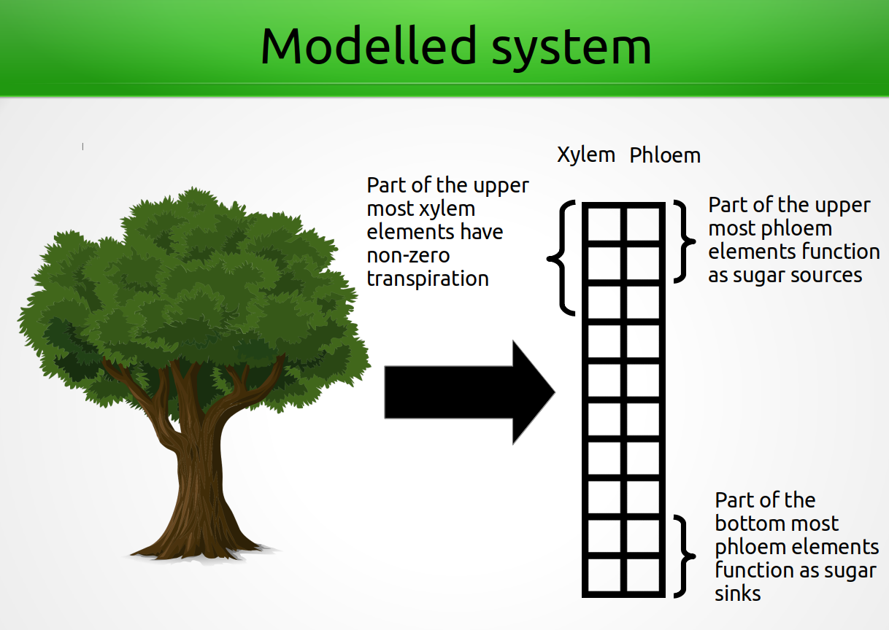

Description of the modelled system
==================================

Introduction
------------

Modelled system is a 2-dimensional array representation of a tree. Each property of the tree is saved in a NumPy array. 
The first column in each array represents values of the xylem and the second column values of the phloem. 
The rows of the arrays represent vertical elements in the tree. 

The row numbering of the arrays starts from the top of the tree (i=0) and ends in the bottom of the tree (i=N).

The number of elements that transpire, produce or unload sugar can be changed by the user. The model is build with the idea, that the sap in both xylem and phloem can contain any number of solutes. However, currently functionality to set, retrieve and update solutes is limited only to sugar (sucrose) in the phloem.

Input and output of the model
-----------------------------

See [instructions how to run the model](instructions_to_run.md) how to give the input to the model.

The fluxes inside the tree
-------------------------------------------------------------------------------

The fluxes shown in the figure above are calculated as follows (the index i refers to rows in any 2D property array in the model). The fluxes are in the units (kg/s)

$$ Q_{ax,i} = Q_{ax,bottom,i} + Q_{ax,top,i} - E_i$$

$$ Q_{ax,bottom,i} = \frac{k_i \: A_{ax,i} \: \rho_w}{\eta_i \: l_i}(P_{i+1} - P_{i} - P_h) $$

$$ Q_{ax,top,i} = \frac{k_i \: A_{ax,i+1} \: \rho_w}{\eta_i \: l_i}(P_{i-1} - P_{i} + P_h) $$

$$ Q_{radial,phloem} = L_r A_{rad,i} \rho_{w} [P_{i,xylem} - P_{i,phloem} - \sigma(C_{i,xylem} - C_{i,phloem}) R T)] $$

$$ Q_{radial,xylem} = -Q_{radial,phloem} $$

where

* Ei: transpiration rate of the ith element (kg/s)
* ki: axial permeability of the ith element (m2)
* Aax,i: base surface area of xylem or phloem (m2)
* &rho;w: liquid phase density of water (kg/m3)
* &eta;: viscosity of the sap in the ith element (Pa s)
* li: length (height) of the ith element (m)
* Pi: Pressure in the ith element (Pa)
* Ph: Hydrostatic pressure (Pa) - Ph = &rho;w agravitation li
* Lr: radial hydraulic conductivity (m/Pa/s)
* Arad,i: lateral surface area of the xylem (m2)
* &sigma;: reflection coefficient (Van't hoff factor) (unitless)
* Ci: sugar concentration in the ith element (mol/m3)
* R: universal gas constant (J/K/mol)
* T: ambient temperature (K)

How the root water uptake is modelled
-------------------------------------------------
The root water uptake is modelled similar to [Volpe et al., (2013)](https://doi.org/10.1016/j.advwatres.2013.07.008). The total conductance of water from soil to the xylem of a root element i in units kg/s is

$$ Q_{root,i} = \frac{g_i}{g} \left(P_{soil,i} - P_{xylem,i}\right) $$

where
* gi: total conductance from soil to the root xylem (s-1)
* g: Gravitational acceleration ($g=9.81\frac{m}{s^2}$)
* Psoil,i: Water potential (pressure) in the soil element i (Pa)
* Pxylem,i: Water potential (pressure) in the xylem of root element i (Pa)

The gravitational acceleration comes from converting the water potential in units $m$ in Volpe et al.,(2013) to Pascals.  This is done by dividing the equation with the speficif weight of water ($\rho_w \cdot g$). The total $q_{root,i}$ of Volpe et al., (2013) is then multiplied with $\rho_w$ to convert the flux to units kg/s.

The total conductance $g_i$ is calculated as

$$ g_i = \frac{1}{k_{s,i}} + \frac{1}{k_{r,i}} \\ = \frac{k_{s,i}\cdot k_{r,i}}{k_{s_i}+k_{r,i}}$$

where

* ks,i is the conductance from soil to near the root system (s-1)
* kr,i is the conductance from near the root system to the root xylem (s-1)

The conductance from soil to near the root system is calculated as

$$ k_{s,i} = \sqrt{\frac{L A_{tree}}{2 r_i \text{RAI}}} K_i \frac{B_i}{A_{tree}} $$

where
* L: Rooting depth (m)
* Atree: Area of ground that the tree takes (m2 ground / tree)
* ri: Effective radius of the roots in layer i (m)
* RAI: Root area index (m2/tree)
* Ki: Horizontal hydraulic conductivity (m/s)
* Bi: Root area density (m2 roots / m ground / tree)

The conductance from near the roots to the xylem is calculated as

$$ k_{r,i} = \frac{B_i \Delta z_i}{A_{tree} \beta} $$

where

* &Delta;zi: Thickness of the soil / root layer (m)
* &beta;: Scale parameter so that the total conductance matches measurements (s)

The change of pressure, sugar concentration and element radius due to sap flux
------------------------------------------------------------------------------
The equations are calcualted based on [Hölttä et al., (2006)](https://link.springer.com/article/10.1007/s00468-005-0014-6)

The change of pressure in the xylem and the phloem due to sap flux is calculated separately for both horizontal elements according to

$$ \frac{\text{d}P_i}{\text{d}t} = \frac{\varepsilon_i}{V_i \rho_w}(Q_{ax,i}+Q_{rad,i}+Q_{root,i}) $$

The change in sugar concentration in the phloem is calculated according to

$$ \frac{\text{d}C_i}{\text{d}t} = \frac{Q_{ax,i}}{V_i} \left(\frac{C_i}{\rho_w} + L_i + U_i \right) $$

The change in element radius in the xylem is calculated according to

$$ \frac{\text{d}R_{xylem,i}}{\text{d}t} = \frac{Q_{ax,i} + Q_{rad,i}}{2 \pi \rho_w l_i (R_{xylem,i}+R_{heartwood})} $$

The change in element radius in the phloem is calculated according to

$$ \frac{\text{d}R_{i,phloem}}{\text{d}t} = \frac{Q_{ax,i} + Q_{rad,i}}{2 \pi \rho_w l_i} \left( \frac{1}{\Sigma_{j=1}^3 R_{j,i}} - \frac{R_{phloem,i}}{(\Sigma_{j=1}^2 R_{j,i})(\Sigma_{j=1}^3 R_{j,i}} \right) $$

where the sum goes from j=1 (the heartwood) to j=3 (the phloem)

* &varepsilon;i: elastic modulus of the ith element (Pa)
* Vi: volume of the ith element (m3)
* Li: sugar loading rate of the ith element (mol/s)
* Ui: sugar unloading rate of the ith element (mol/s)
* &rho;w: liquid phase density of water (kg/m3)
* li: length (height) of the ith element (m)
* Ci: Sucrose concentration in the ith element (mol/m3)
* Qax/rad,i: axial or radial sap flux of the ith element (kg/s)
* Ri: radius of the ith element (m)
* Pi: pressure in the ith element (Pa)

For root elements the rate of radius change of both xylem and phloem is set to zero.

$$ \frac{\text{d}R_{i,xylem/phloem}}{\text{d}t} = 0;  i \in \text{roots}$$

Sugar loading and unloading rates
---------------------------------

Currently in the model the sugar loading rate should be set equal to the photosynthesis rate when the tree is created.

The initial unloading rate needs to be set but it is updated according to
[Nikinmaa et. al., (2014)](https://academic.oup.com/aob/article/114/4/653/2769025)

$$ U_i = A_{rad,i} \max{ [0, u_s (C_i - C_0)]}$$

where

* Arad,i: radial surface area between the xylem and the phloem (i.e., lateral area of the xylem)
* us: sugar unloading slope set
* Ci: sugar concentration in the ith element
* C0: sugar target concentration

How the element radii are modelled
-------------------------------------------------

The radius of each horizontal element (heartwood, xylem and phloem) are given as the width of the element.
For example, **given total tree diameter of 10 cm, heartwood radius of 2 cm and 90/10% split between the phloem
and the xylem**. The traditional radii of each element (distance from the pith) would be
* Heartwood: 2 cm
* Xylem: 4.7 cm
* Phloem 5 cm

**In the model the radiis are given as the width of the horizontal element, i.e.:**
* Heartwood: 2 cm
* Xylem: 2.7 cm
* Phloem: 0.3 cm